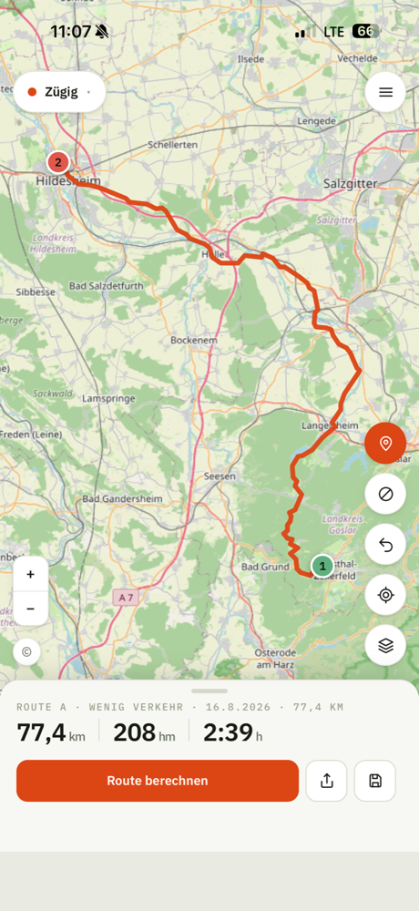
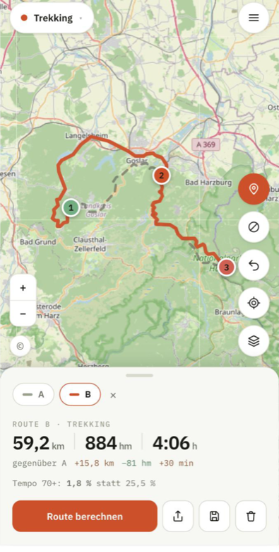
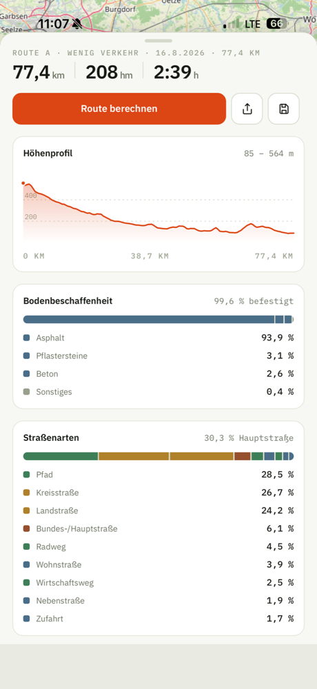
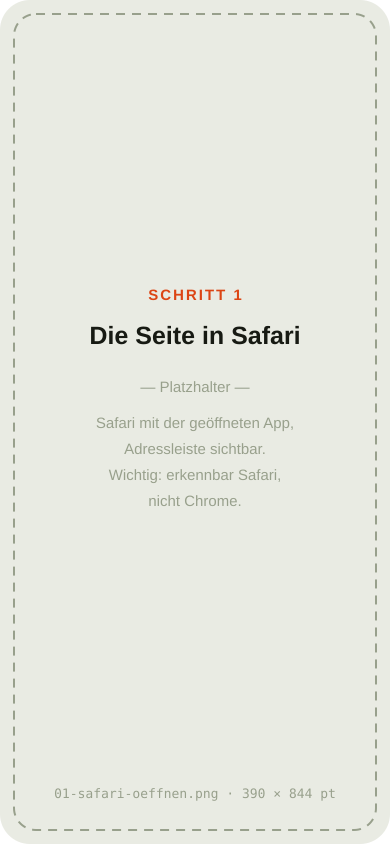
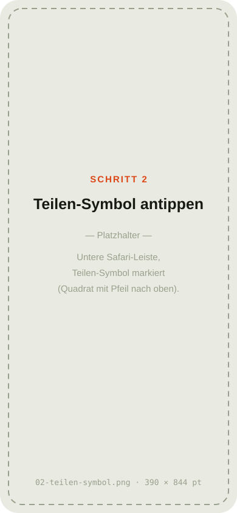
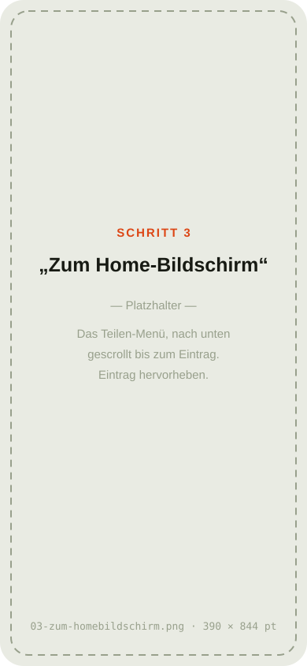
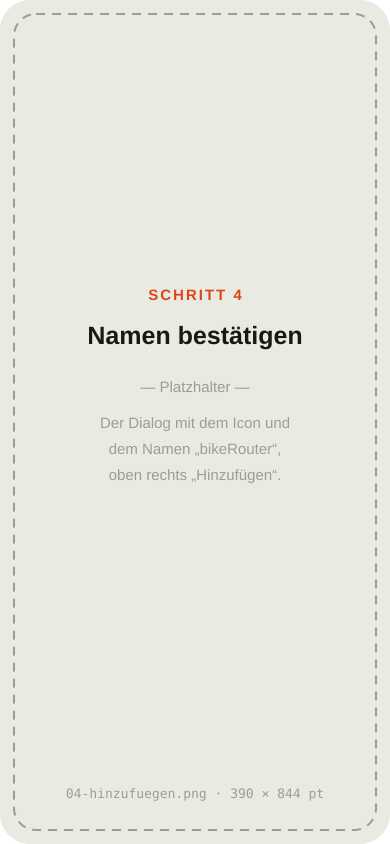
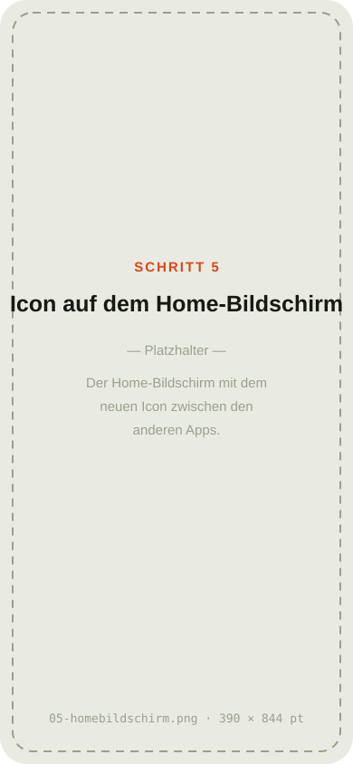
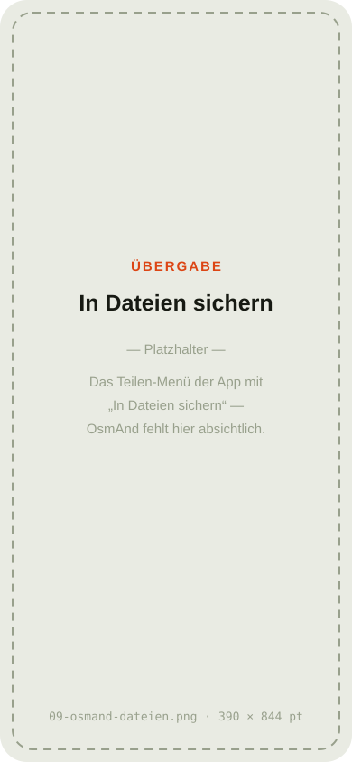

<h1 align="center">bikeRouteriOS</h1>

Ein Radrouten-Planer fürs iPhone, der zeigt, <b>wie</b> er rechnet.

Komoot, Strava und cycle.travel verstecken ihre Routing-Logik hinter Profilen,
die niemand einsehen kann. [BRouter](https://brouter.de) macht die Regeln
transparent — hat aber keine iPhone-App und keine Tourenverwaltung. Diese Web-App
schließt die Lücke.

**→ [App öffnen](https://dleitz-projects.github.io/bikeRouterIOS/)**

  
  
  

<i>Dieselbe Strecke, zwei Profile: „Wenig Verkehr" fährt 43,4 km
mit 25,5 % schnellen Straßen, „Trekking" 59,2 km mit 1,8 %. 
Genau dieser Unterschied ist der Grund für die App.</i>

---

## Installieren — 5 Schritte, 1 Minute

Es gibt nichts im App Store. Die App wird direkt aus Safari auf den
Home-Bildschirm gelegt und verhält sich danach wie eine normale App.

<table>
<tr>
<td width="160"></td>
<td>

**1. [Den Link in Safari öffnen](https://dleitz-projects.github.io/bikeRouterIOS/)**

⚠️ Wirklich **Safari** — Chrome und Firefox können auf dem iPhone keine Apps auf
den Home-Bildschirm legen.

</td>
</tr>
<tr>
<td></td>
<td>

**2. Teilen-Symbol antippen**

Das Quadrat mit dem Pfeil nach oben, unten in der Mitte der Safari-Leiste.

</td>
</tr>
<tr>
<td></td>
<td>

**3. „Zum Home-Bildschirm" wählen**

Im Menü nach unten wischen — der Eintrag steht weit unten in der Liste.

</td>
</tr>
<tr>
<td></td>
<td>

**4. Oben rechts auf „Hinzufügen"**

Der vorgeschlagene Name `bikeRouter` passt — er ist kurz genug, dass iOS ihn
nicht abschneidet.

</td>
</tr>
<tr>
<td></td>
<td>

**5. Safari schließen, App vom Home-Bildschirm starten**

Sie läuft jetzt im Vollbild, ohne Adressleiste.

</td>
</tr>
</table>

**Warum der letzte Schritt zählt:** Nur vom Home-Bildschirm gestartet
funktioniert das Teilen der GPX-Datei zuverlässig, und die App merkt sich ihre
Touren dauerhaft.

---

## Die erste Route

1. **Auf die Karte tippen** setzt den Startpunkt, ein zweiter Tipp das Ziel.
   Jeder weitere Punkt hängt sich hinten an.
2. **„Route berechnen"** unten. Es wird nur auf Knopfdruck gerechnet, nie
   automatisch — der Server ist gespendete Infrastruktur.
3. **Am Griff ziehen** öffnet die Analyse: Höhenprofil, Belag, Straßenarten.
4. **Profil wechseln und noch einmal rechnen** legt die zweite Route dazu. Beide
   bleiben liegen, der Unterschied steht als Differenz darunter.

---

## Auf dem Rad: die Route nach OsmAnd bringen

Diese App **navigiert nicht**. Sie plant und übergibt.

Die beste Ziel-App, die ich gefunden habe, ist
**[OsmAnd](https://osmand.net)** — kostenlos, Offline-Karten, freie Software.
Wer eine bessere kennt: gern melden.

**Wichtig vor dem Export:** Im Profil unter *GPX-Export* den Punkt
**„Abbiegehinweise in der Datei"** auf **OsmAnd** stellen. Die Voreinstellung
„automatisch" erzeugt nachgemessen **gar keine** Hinweise — die Datei enthält
dann nur die Linie.

### Der Weg, der funktioniert

<table>
<tr>
<td width="160"></td>
<td>

1. In der App auf **Teilen** (Pfeil nach oben) tippen.
2. **„In Dateien sichern"** wählen.
3. Die **Dateien-App** öffnen, die GPX-Datei antippen und halten.
4. **„Teilen" → OsmAnd**, oder in OsmAnd unter *Meine Orte → Tracks →
   Importieren*.

</td>
</tr>
</table>

### Warum nicht direkt?

**OsmAnd erscheint nicht im Teilen-Menü.** Das liegt an OsmAnd, nicht an dieser
App: OsmAnd meldet sich bei iOS nur als Dokument-Handler an, nicht als
Teilen-Ziel. Der Umweg über die Dateien-App ist deshalb kein Fehler, sondern
der vorgesehene Weg.

---

## Was die App kann

- **Karte antippen** setzt Wegpunkte, Marker lassen sich verschieben und
  einzeln löschen.
- **Sperrbereiche**: Kreise, die die Route umfährt — für Städte oder bekannte
  Baustellen.
- **29 Routing-Profile**, alle nachgemessen. Vier davon sind bis auf jeden
  Parameter einstellbar.
- **Routenvergleich**: Mehrere Berechnungen bleiben liegen, die Unterschiede
  stehen als Differenz nebeneinander.
- **Analyse** jeder Route: Höhenprofil zum Anfahren, Belag, Straßenarten,
  Anteil schneller Straßen.
- **Baukasten**: Regeln, die BRouter von Haus aus nicht hat — etwa das
  Tempolimit als eigene Kostendimension.
- **Tourenarchiv** mit Sicherung als Datei.
- **Vier Kartenbilder**: Standard, Fahrradkarte, Gelände.

## Was die App nicht kann — und nicht können soll

Keine Turn-by-turn-Navigation. Keine Aufzeichnung von Fahrten. Kein Konto,
keine Anmeldung, keine Server bei mir. Alle Daten bleiben auf dem Gerät.

---

## Für Neugierige: warum das alles dokumentiert ist

Dieses Repo enthält mehr Dokumentation als Code, und das mit Absicht. Jede
Behauptung über das Routing ist gegen den echten Server gemessen, mit Datum.

| Datei | Inhalt |
|---|---|
| [`CLAUDE.md`](CLAUDE.md) | Was gilt: Entscheidungen, Regeln, Nicht-Ziele |
| [`BROUTER.md`](BROUTER.md) | Wie die Engine rechnet — mit allen Messungen |
| [`SERVER.md`](SERVER.md) | Wer die Server betreibt und was sie aushalten |
| [`PROFILE.md`](PROFILE.md) | Welche Profile es gibt und was ihre Namen verschweigen |
| [`UMSETZUNG.md`](UMSETZUNG.md) | Was beim Bauen entschieden wurde |
| [`OFFENE-PUNKTE.md`](OFFENE-PUNKTE.md) | Was noch offen ist |
| [`IDEEN.md`](IDEEN.md) | Was man bauen könnte — auch Verworfenes mit Begründung |

Ein Beispiel für die Art der Belege: `fastbike-lowtraffic` und `fastbike` sind
**dasselbe Profil** mit einem anderen Wert für `consider_traffic` — nachgemessen
in Länge, Kosten und Höhenmetern gleichzeitig. Solche Dinge stehen in keiner
Dokumentation, man muss sie messen.

---

## Technisch

Vanilla JavaScript, kein Framework, kein Build-Prozess. Die Dateien im Repo sind
exakt die, die ausgeliefert werden. [Leaflet](https://leafletjs.com) für die
Karte, [BRouter](https://brouter.de) fürs Routing, Kartendaten von
[OpenStreetMap](https://www.openstreetmap.org/copyright).

Lokal starten: `python3 -m http.server` im Projektverzeichnis, dann
`http://localhost:8000` öffnen. Ein Webserver ist nötig — per Doppelklick
geöffnet funktioniert der Service Worker nicht.

## Dank

An **Arndt Brenschede** für BRouter, an **Marcus Jaschen** für
[bikerouter.de](https://bikerouter.de), an die OpenStreetMap-Mitwirkenden und an
FOSSGIS für die gespendete Infrastruktur, auf der die Routen berechnet werden.
